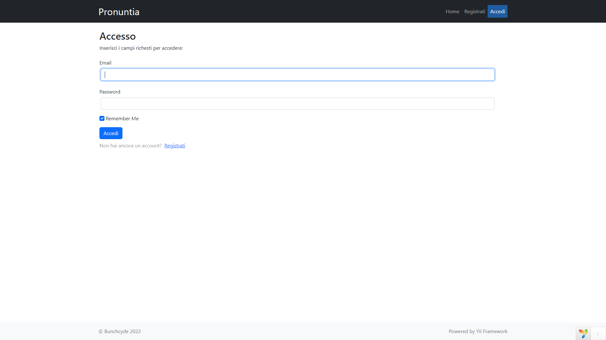
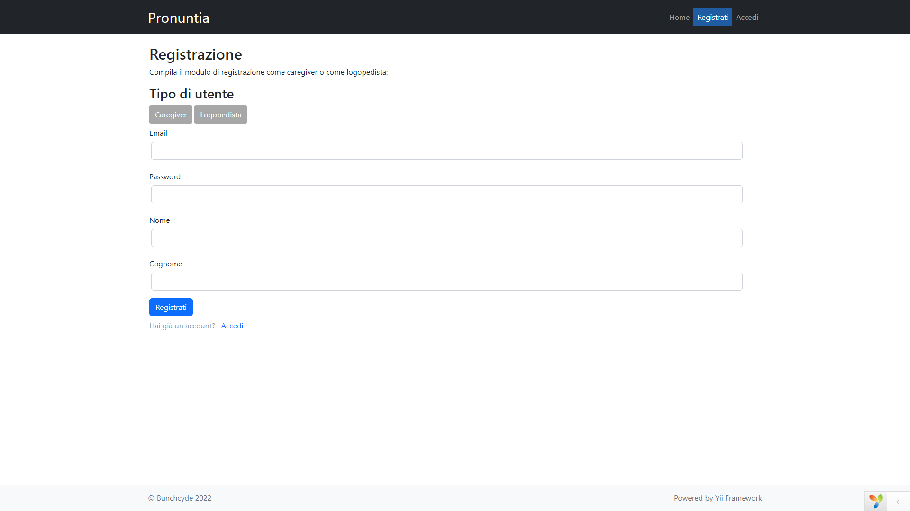

    
    <h1 align="center">Yii 2 Pronuntia</h1>
     

PROJECT
-------
This project is an university assignation for software engineering exam, the idea is to made a website that can help speech therapists and patients affected by speech or phonetic disturbances, allowing them to communicate and let the patients to follow therapies provided by speech therapists.
 
<ul>
    <li>The project language is only Italian, due to lack of time i've not planned to handle translations.</li>
 
    <li>Project tables are made through migrations.</li>
</ul>

SCREENSHOT
----------

DIRECTORY STRUCTURE
-------------------

      assets/             contains assets definition
      commands/           contains console commands (controllers)
      config/             contains application configurations
      controllers/        contains Web controller classes
      mail/               contains view files for e-mails
      models/             contains model classes
      runtime/            contains files generated during runtime
      tests/              contains various tests for the basic application
      vendor/             contains dependent 3rd-party packages
      views/              contains view files for the Web application
      web/                contains the entry script and Web resources
